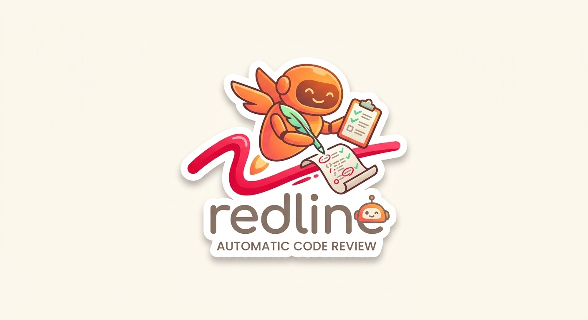

<p align="center">
  
</p>

# redline

Automatic code review for AI coding agents, powered by OpenRouter.

Run `redline` in any git repo to enable automatic cross-reviews between Claude Code and Codex. When your main agent makes code changes, the other agent reviews them in the background.

## How it works

**Default: Codex reviews Claude Code**

```
Claude Code Stop hook (fast, <1s)
  → redline check
  → any uncommitted changes? (deduplicated by diff hash)
  → if changes detected:
      tells Claude to run `codex exec review --uncommitted` as a background task
      visible in background tasks, killable, streams output
      Claude reads the results and presents findings
  → if no changes:
      exits silently
```

**Reverse: Claude reviews Codex** (`--reviewer=claude`)

```
Codex SessionStart hook
  → redline check --reviewer=claude
  → injects review protocol instructions into Codex's context
  → Codex runs `claude -p "Review uncommitted changes..."` as a background task
      after making substantial changes
```

Reviews are **async** — your main agent keeps working while the reviewer runs in the background.

## Setup

Requires [Bun](https://bun.sh), [Claude Code](https://docs.anthropic.com/en/docs/claude-code), and [Codex CLI](https://github.com/openai/codex).

```bash
git clone https://github.com/alexanderatallah/redline.git
cd redline
bun install
bun link
```

### Authentication

All inference is routed through [OpenRouter](https://openrouter.ai):

```bash
# Option 1: OAuth (opens browser)
redline login

# Option 2: Environment variable
export OPENROUTER_API_KEY=sk-or-...
```

## Quick start

```bash
cd your-project

# Codex reviews Claude Code (default)
redline

# Claude Code reviews Codex
redline --reviewer=claude
```

## Commands

| Command | Description |
|---------|-------------|
| `redline` | Enable reviews — Codex reviews Claude Code (default) |
| `redline --reviewer=claude` | Enable reviews — Claude Code reviews Codex |
| `redline [model]` | Enable with a custom reviewer model |
| `redline off` | Disable reviews |
| `redline off --reviewer=claude` | Disable Claude-reviews-Codex mode |
| `redline review [model]` | Run a Codex review manually |
| `redline review --reviewer=claude [model]` | Run a Claude review manually |
| `redline login` | Authenticate with OpenRouter |

### Model customization

Pass any [OpenRouter model slug](https://openrouter.ai/models) to customize the reviewer:

```bash
# Custom Codex reviewer model
redline openai/gpt-5.4-pro

# Custom Claude reviewer model
redline --reviewer=claude anthropic/claude-opus-4-6
```

## Loop prevention

If both hooks are installed (Codex reviewing Claude AND Claude reviewing Codex), redline prevents infinite review loops by setting `REDLINE_REVIEWING=1` in the environment when spawning review agents. The check command exits silently when this env var is set.

## How each hook works

### Codex reviews Claude Code (default)

- Installs a **Stop hook** in `.claude/settings.local.json`
- Fires after every Claude response, checks for uncommitted changes
- Uses `decision: "block"` to inject the review command into Claude's context
- Claude decides whether changes warrant a review and spawns it in the background
- Deduplicates via diff hash (`.git/redline-last-diff`)

### Claude reviews Codex (`--reviewer=claude`)

- Installs a **session_start hook** in `~/.codex/config.toml`
- Fires once at the start of each Codex session
- Injects review protocol instructions into Codex's context
- Codex follows the protocol to run Claude reviews after significant changes
- No deduplication needed (fires once per session)

## Requirements

- [Bun](https://bun.sh) runtime
- [Claude Code](https://docs.anthropic.com/en/docs/claude-code)
- [Codex CLI](https://github.com/openai/codex)
- [OpenRouter](https://openrouter.ai) account

## License

MIT
